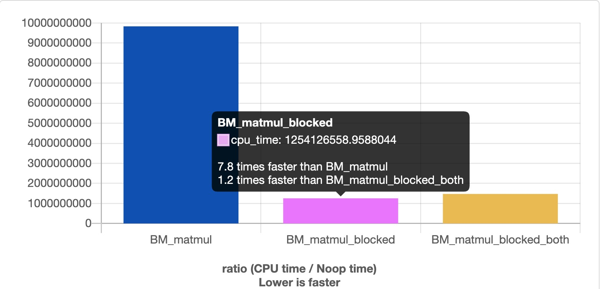
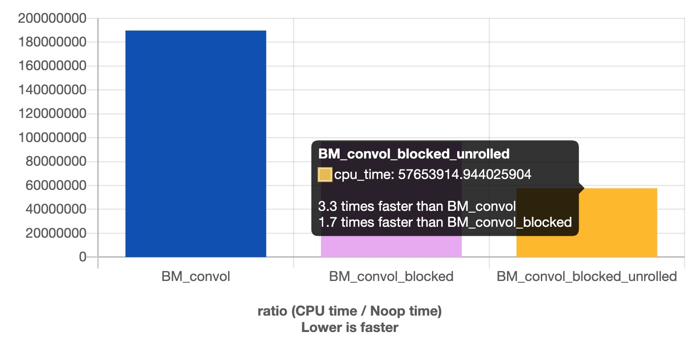

- [并行计算项目概要](#并行计算项目概要)
- [mylib | 代码库](#mylib--代码库)
  - [帮手类](#帮手类)
    - [ticktock.h | bate.h | mtprint.h](#ticktockh--bateh--mtprinth)
    - [pod.h](#podh)
  - [数据结构类](#数据结构类)
    - [稀疏数据结构 snode.h](#稀疏数据结构-snodeh)
    - [alignalloc.h | alignalloc_msvc.h](#alignalloch--alignalloc_msvch)
    - [ndarray.h | ndarray_msvc.h](#ndarrayh--ndarray_msvch)
- [康威生命游戏优化](#康威生命游戏优化)
  - [代码环境](#代码环境)
  - [实验优化记录](#实验优化记录)
  - [优化方法总结](#优化方法总结)
- [memory_optimization | 访存优化](#memory_optimization--访存优化)
  - [矩阵乘法优化](#矩阵乘法优化)
    - [matrix_mul.cpp](#matrix_mulcpp)
  - [小卷积核优化](#小卷积核优化)
    - [kernel_convol.cpp](#kernel_convolcpp)
  - [aosoa数据结构](#aosoa数据结构)
    - [aosoa.cpp](#aosoacpp)
  - [矩阵遍历 & 矩阵alloc](#矩阵遍历--矩阵alloc)
    - [xy_yx_loop.cpp](#xy_yx_loopcpp)
    - [matrix_alloc.cpp](#matrix_alloccpp)
  - [缓存行 & 预取 & 缓存读写 & 伪共享](#缓存行--预取--缓存读写--伪共享)
    - [cache_skip.cpp](#cache_skipcpp)
    - [prefetch.cpp](#prefetchcpp)
    - [write_read.cpp | write_read_msvc.cpp](#write_readcpp--write_read_msvccpp)
    - [false_sharing.cpp](#false_sharingcpp)
- [cuda_practice | CUDA 实践](#cuda_practice--cuda-实践)
  - [include（辅助类）](#include辅助类)
    - [helper_cuda.h | helper_string.h](#helper_cudah--helper_stringh)
    - [CudaAllcator.h | CudaAllcator_MSVC.h](#cudaallcatorh--cudaallcator_msvch)
  - [网格跨步循环](#网格跨步循环)
    - [grid_stride_loop.cu](#grid_stride_loopcu)
  - [矩阵转置](#矩阵转置)
    - [mat_trans.cu  | thrust_trans.cu](#mat_transcu---thrust_transcu)
    - [mat_trans_shared.cu](#mat_trans_sharedcu)
  - [矩阵乘法](#矩阵乘法)
    - [mat_mul.cu](#mat_mulcu)
    - [mat_mul_shared.cu](#mat_mul_sharedcu)
  - [GPU优化手法总结](#gpu优化手法总结)
- [参考资料](#参考资料)
- [致谢](#致谢)

# 并行计算项目概要

> 实践：
>
> - 康威生命游戏优化
>
> - 矩阵乘法优化 小内核卷积优化（X86_CPU）
> - CUDA实践 矩阵乘法 （RTX2060）


| 文件                  | 作用                 | 具体优化                    |
| --------------------- | -------------------- | --------------------------- |
| CMakeLists.txt        | 顶层CMake构造项目    |                             |
| mylib                 | 包含各种功能的头文件 |                             |
| sparse_data_structure | 各类稀疏数据结构代码 |                             |
|                       |                      |                             |
| src                   | 康威生命游戏源码文件 | 并行优化+稀疏数据结构       |
| memory_optimization   | 访存优化代码         | 矩阵乘法优化+小内核卷积优化 |
| cuda_practice         | GPU cuda编程实践     | 矩阵乘法优化                |


# mylib | 代码库

## 帮手类

### ticktock.h | bate.h | mtprint.h

- 基于 `std::chrono` 获取时间
- frand() 获取随机数
- `mtprint.h` 用于打印多维数组

### pod.h

- vector的初始化，写入了0, 即为一次分配，一次写入。
- 让数据结构不会初始化写入，相乘malloc一样的惰性初始化。

## 数据结构类

###  稀疏数据结构 snode.h

- 三层嵌套稀疏数据结构
- BUG：会引起内存爆炸，待修改

### alignalloc.h | alignalloc_msvc.h

> 指定对齐到任意字节

- `std::vector<int, AlignedAllocator<int, 4096>> arr(n);`
- `alignalloc_msvc.h`  适配msvc的版本  ： `aligned_alloc `并未被MSVC支持，但改用其 `_aligned_malloc`即可；

### ndarray.h | ndarray_msvc.h      

> 一维数组模拟高维数组

- ZYX 序：(z * ny + y) * nx + x , 避免手动扁平化高维数组，封装成类
- ndarray<2, float>  二维浮点数组，ndarray<3, int> 三维整型数组。
- 解决访问越界问题，增加额外的参数，控制边界层的大小

​	`consexptr int nblur = 8 ;  ndarray<2, float, nblur> a(nx, ny);`

- 有些 SIMD 指令要求地址对齐到一定字节数，否则会 segfault，如 _mm256_stream_ps 需要对齐到 32 字节。因此使用 AlignedAllocator 让 vector 的内存分配，始终对齐到 64 字节（缓存行）

​		`ndarray<2,float, 0 ,0 ,32> a(nx, ny)`

- MSVC 的模板元编程偏差，需要修改模板

```c++
 // template <class ...Ts, std::enable_if_t<sizeof...(Ts) == N && (std::is_integral_v<Ts> && ...), int> = 0>

    template <class ...Ts, std::enable_if_t<sizeof...(Ts) == N && std::conjunction_v<std::is_integral<Ts>...> , int> = 0>
```

# 康威生命游戏优化

## 代码环境

> WSL + GCC 9.2

> Parallel_Computing_Practice/src/Conway_Game_of_Life.cpp

## 实验优化记录

- 原始代码未开启openMP

```
134.008686s
```

- 原始代码开启openMP

```
49.100373s        加速：2.72x
```

- 使用指针数组这种稀疏数据结构来优化

```
OpenMp  29.86s    加速：4,48x
tbb     17.48s    加速：7.66x
```

- 在指针数组加上spin_mutex优化，效果不明显

```
 openMP 33.47s    加速：4.06x
 tbb    17.76s    加速：7.54x
```

## 优化方法总结

**封装稀疏网格的 Grid 类的？**

- 采用指针数组封装稀疏的Grid表格
- 为了减轻mutex的系统开销，使用了spin_mutex自旋锁
- 如果使用hash().pointer().dense的话，在WSL上回出现 out of memory

**使用位运算量化减轻内存带宽？**

- & 替代 %， >> 替代 /， | 替代 +

**使用并行访问访问库进行优化？**

- 使用OpenMP进行并行访问。

**有没有用访问者模式缓存坐标，避免重复上锁？**

- 没有使用, 在WSL里使用这个，会莫名出现segment fault

**`step()` 函数中这种插桩方式优化**

- 将step()改造成了tbb并行。


# memory_optimization | 访存优化

https://quick-bench.com/ benchmark在线测试网站

https://github.com/google/benchmark

## 矩阵乘法优化

### matrix_mul.cpp 

> 如何与优化矩阵乘法

- 寄存器分块（类似循环分块）
- `a(i , j) += b(i, t) * c(t , j)`
- 循环结构: 最外层 `jBase` , `iBase` 然后进行`jBase`的分块， 然后再是t 遍历，最后是`iBase`的分块

```c++
for(int jBase = 0 ; jBase < n ; jBase += 16){
	for(int iBase = 0; iBase < n; iBase += 16){
        for(int j = jBase ; j < jBase + 16 ; j++){
            for(int t = 0; t < n ; t++){
                for(int i = iBase; i < iBase + 16; i++){
                    a(i, j) += b(i, t) * c(t, j);
            	}
        	}
    	}
	}
}
```


## 小卷积核优化

### kernel_convol.cpp 

- 小内核卷积

- a 结果 b (nkern填充padding) c (卷积核)

```c++
ndarray<2, float> a(n, n);
ndarray<2, float, nkern> b(n, n);
ndarray<2, float> c(nkern, nkern);
```

- 基础卷积 外面两层循环 `i, j` 代表结果 内部两层循环代表卷积核相乘

```c++
for(int j = 0; j < n; j++){
    for(int i = 0 ;i < n; i++){
        for(int l = 0; l < nkern ; l++){
            for(int k = 0; k < nker ; k++){
                a(i , j) += b( i + k , j + l) * c(k , l);
            }
        }
    }
}
```

- 循环分块 循环展开 
- 最外层 `jBase` , `iBase` ， 然后是 `l , k`, 然后是`jBase` , `iBase`的分块结果

```c++
 constexpr int blockSize = 4;
        for (int jBase = 0; jBase < n; jBase += blockSize) {
            for (int iBase = 0; iBase < n; iBase += blockSize) {
                for (int l = 0; l < nkern; l++) {
                    for (int k = 0; k < nkern; k++) {
                        for (int j = jBase; j < jBase + blockSize; j++) {
#pragma GCC unroll 4
                            for (int i = iBase; i < iBase + blockSize; i++) {
                                a(i, j) += b(i + k, j + l) * c(i, j);
                            }
                        }
                    }
                }
            }
        }
```



## aosoa数据结构

### aosoa.cpp 

>  数据结构的底层矢量化和缓存行预取

- AOS（Array of Struct）单个对象的属性紧挨着存
- SOA（Struct of Array）属性分离存储在多个数组
- MyClass 内部是 SOA，外部仍是一个 `vector<MyClass>` 的 AOS——这种内存布局称为 AOSOA。
- **如果几个属性几乎总是同时一起用的**，比如位置矢量pos的xyz分量，可能都是同时读取同时修改的，这时用**AOS**，减轻预取压力。
- **如果几个属性有时只用到其中几个，不一定同时写入**，这时候就用**SOA**比较好，省内存带宽。
- **AOSOA**：在高层保持AOS的统一索引，底层又享受SOA带来的矢量化和缓存行预取等好处


## 矩阵遍历 & 矩阵alloc 

### xy_yx_loop.cpp

> 验证xy序 和 yx序

### matrix_alloc.cpp

> STL容器的多维数组alloc 和 展开的多维数组alloc数组速度比较


## 缓存行 & 预取 & 缓存读写 & 伪共享

### cache_skip.cpp

> 验证缓存的读写机制


### prefetch.cpp

> 解决随机的预取问题

- 缓存行预取技术：由硬件自动识别程序的访存规律，决定要预取的地址。一般来说只有线性的地址访问规律（包括顺序、逆序；连续、跨步）能被识别出来，而**如果访存是随机的，那就没办法预测**。
- 为了解决随机访问的问题，把分块的大小调的更大一些，比如 4KB 那么大，即64个缓存行，而不是一个。每次随机出来的是块的位置。
- 预取不能跨越页边界，否则可能会触发不必要的 page fault。所以选取页的大小，因为本来就不能跨页顺序预取，所以被我们切断掉也无所谓。


### write_read.cpp | write_read_msvc.cpp

> 为写入花的时间比读取慢：写入的粒度太小，浪费了缓存行的代码

- https://www.intel.com/content/www/us/en/docs/intrinsics-guide/index.html
- 绕过缓存，直接写入：`_mm_stream_si32`，代替直接赋值的写入，绕开缓存**，将一个4字节的写入操作，挂起到临时队列，等凑满64字节后，直接写入内存，从而完全避免读的带宽。只支持int做参数，要用float还得转换一下指针类型，bitcast一下参数。
- stream特点：不会读到缓存里， 最好是连续的写入
- 1.只有写入，没有读取 2.之后没有再读取该数组 才应该使用`stream`指令
- `_mm_stream_si32` 可以一次性写入4字节到挂起队列。而 `_mm_stream_ps` 可以一次性写入 16 字节到挂起队列。


### false_sharing.cpp

> 如何消除伪共享

- CPU为了安全起见，同时只能允许一个核心写入同一地址的缓存行。从而导致读写这个变量的速度受限于三级缓存的速度，而不是一级缓存的速度。
- 消除错误共享很简单，只需要把每个核心写入的地址尽可能分散开了就行了。
- 错误共享只会发生在**写入**的情况，如果多个核心同时**读取**两个很靠近的变量，是不会产生冲突的，也没有性能损失。


# cuda_practice | CUDA 实践

## include（辅助类）

### helper_cuda.h | helper_string.h

- 定义了 `checkCudaErrors` 这个宏，使用时只需：`checkCudaErrors(cudaDeviceSynchronize())`

  自动检查错误代码并打印在终端，退出。还会报告出错所在的行号，函数名等。

### CudaAllcator.h | CudaAllcator_MSVC.h

- `std::vector<int, CudaAllocator<int>> arr(n);`标准库容器在CUDA统一内存上构造。
- MSVC版本根据微软的文档要求进行改造。

## 网格跨步循环

### grid_stride_loop.cu

| 维度        | 意义                   |
| ----------- | ---------------------- |
| `gridDim`   | 总的板块数量           |
| `blockIdx`  | 当前板块的编号         |
| `blockDim`  | 当前板块中的线程数量   |
| `threadIdx` | 当前线程在板块中的编号 |

扁平化  `tid`获取线程在网格中的编号 `tnum` 总的线程数

```c++
unsigned int tid = blockDim.x * blockIdx.x + threadIdx.x;
unsigned int tnum = blockDim.x * gridDim.x;
```

- 无论调用者指定了多少个线程`（blockDim）`，都能自动根据给定的 `n` 区间循环，不会越界，也不会漏掉几个元素。

```c++
for(int i = blockDim.x * blockIdx.x + threadIdx.x ; i < n; i += blockDim.x * gridDim.x){
        arr[i] = i;
}
```

- 外部调用者，则是根据不同的 `n` 决定板块的数量`（gridDim）`，而每个板块具有的线程数量`（blockDim）`则是固定的 128。
- 利用向上取整，解决边角料难题。`(n + threadsPerBlock -1)`
- 如果利用了冗余的线程，那么在核函数中就要加上判断 `idx < n ` （for循环的作用）用于判断越界

```c++
int threadsPerBlock = 128;
int blocksPerGrid = (n + threadsPerBlock -1)/ threadsPerBlock;
kernel<<<blocksPerGrid, threadsPerBlock>>>(arr, n);
```

## 矩阵转置

### mat_trans.cu  | thrust_trans.cu
- `thrust_trans.cu` 基于`thrust`库写的转置版本

```c++
template <class T>
__global__ void parallel_transpose(T *out, T const *in, int nx, int ny) {
    int x = blockIdx.x * blockDim.x + threadIdx.x;
    int y = blockIdx.y * blockDim.y + threadIdx.y;
    if (x >= nx || y >= ny) return;
    out[y * nx + x] = in[x * nx + y];
}
```

### mat_trans_shared.cu

> 利用共享内存解决跨步读取的问题

- 通过把 输入分块，按块跨步地读，而块内部则仍是连续地读——从低效全局的内存读到高效的共享内存中，然后在共享内存中跨步地读，连续地写到 out 指向的低效的全局内存中。

```c++
template <int blockSize, class T>
__global__ void parallel_transpose(T *out, T const *in, int nx, int ny) {
    int x = blockIdx.x * blockSize + threadIdx.x;
    int y = blockIdx.y * blockSize + threadIdx.y;
    if (x >= nx || y >= ny) return;
    __shared__ T tmp[blockSize * blockSize];
    int rx = blockIdx.y * blockSize + threadIdx.x;
    int ry = blockIdx.x * blockSize + threadIdx.y;
    tmp[threadIdx.y * blockSize + threadIdx.x] = in[ry * nx + rx];
    __syncthreads();
    out[y * nx + x] = tmp[threadIdx.x * blockSize + threadIdx.y];
}
```

## 矩阵乘法

### mat_mul.cu

>cpu_time: 18.342873s
 gpu_mul: 0.138261s


```c++
template <int blockSize, class T>
__global__ void parallel_mul(T * c, T const * a , T const * b, int M, int N, int K) {
    int m = threadIdx.x + blockIdx.x * blockDim.x;
    int n = threadIdx.y + blockIdx.y * blockDim.y;

    if(m >= M || n >= N) return;

    int tmp = 0;
    for(int t = 0 ; t < K; t++){
        tmp += a[m * K + t] * b[t * N + n];
    } 

    c[m * N + n] = tmp;
}
```

### mat_mul_shared.cu

>cpu_time: 22.308820s
 gpu_mul: 0.031329s


```c++
template <int BLOCK_SIZE, class T>
__global__ void parallel_mul_shared_chiemon(T * c, T const * a , T const * b, int M, int N, int K){
    int nRow = blockIdx.y * blockDim.y + threadIdx.y;
    int nCol = blockIdx.x * blockDim.x + threadIdx.x;
    int fCVal = 0.0f;

    __shared__ float shTileA[BLOCK_SIZE][BLOCK_SIZE];
    __shared__ float shTileB[BLOCK_SIZE][BLOCK_SIZE];

    int nIter = (K + BLOCK_SIZE - 1) / BLOCK_SIZE;
    for(int i = 0; i < nIter; i++)
    {
        // load data from global memory to shared memory
        shTileA[threadIdx.y][threadIdx.x] = a[nRow * K + i * BLOCK_SIZE + threadIdx.x];
        shTileB[threadIdx.y][threadIdx.x] = b[(i * BLOCK_SIZE + threadIdx.y) * N + nCol];

        // sync to wait for all threads in one block to finish loading datas
        __syncthreads();

        // sub-matrix multiply
        for(int l = 0; l < BLOCK_SIZE; l++)
        {
            fCVal += shTileA[threadIdx.y][l] * shTileB[l][threadIdx.x];
        }

        // sync to wait for all threads in one block to finish compute
        __syncthreads();
    }

    // store results into global memory
    c[nRow * N + nCol] = fCVal;
}
```

## GPU优化手法总结

| 优化手法                      | 具体实现                                                     |
| ----------------------------- | ------------------------------------------------------------ |
| 线程组分歧（wrap divergence） | 保证 32 个线程都进同样的分支，否则两个分支都会执行。         |
| 延迟隐藏（latency hiding）    | 有足够的 `blockDim` 供 SM 在陷入内存等待时调度到其他线程组。 |
| 寄存器打翻（register spill）  | 如果核函数用到很多局部变量（寄存器），则 blockDim 不宜太大。 |
| 共享内存（shared memory）     | 全局内存比较低效，如果需要多次使用，可以先读到共享内存。     |
| 跨步访问（coalesced access）  | 建议先顺序读到共享内存，让高带宽的共享内存来承受跨步。       |
| 区块冲突（bank conflict）     | 同一个 warp 中多个线程访问共享内存中模 32 相等的地址会比较低效，可以把数组故意搞成不对齐的 33 跨步来避免。 |


# 参考资料


# 致谢 

- 感谢小彭老师的parallel_101课程带我入门，本仓库辅助代码与作业代码大部分参考于小彭老师的并行计算课程仓库。

> ​		https://github.com/archibate                  
>
> ​		https://github.com/parallel101

- 感谢王小明同学的技术支持和耐心指导，在学习过程中碰到了各种奇奇怪怪的错误：环境安装出错，CMake出了bug，编译出错，内存爆炸，Debug失效。都在他的细心指导下一一解决，从对C++的一无所知到现在的浅入门庭，谢谢他的一路陪伴。
> ​		https://qifanwang.github.io/